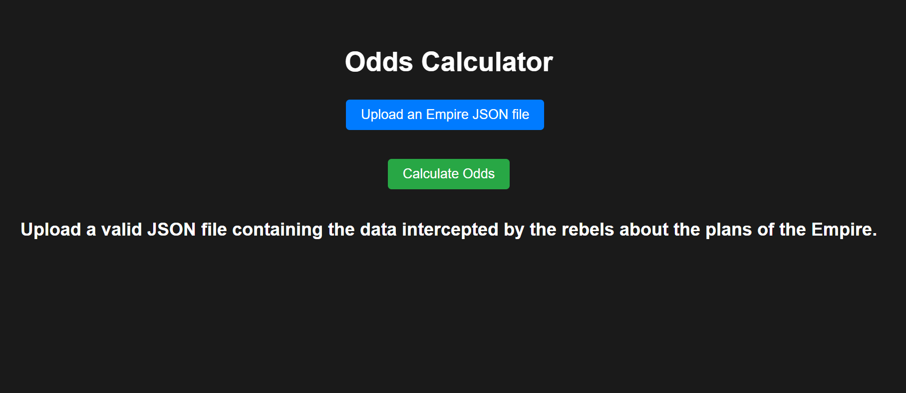
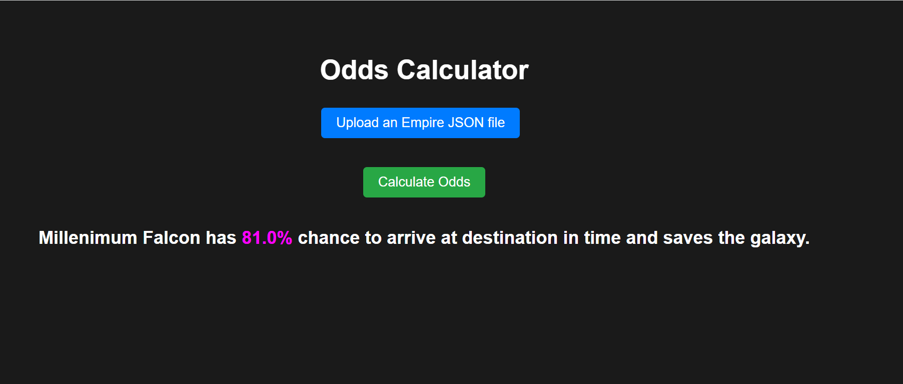

# The Millenium Falcon challenge


## Overview

This repository provides a solution to the Millenium Falcon challenge. The challenge is available at https://gisk.ar/jobs-software-test .

## Installation


Clone this repository:

```sh
$ git clone https://github.com/Abdoulaye-Koroko/developer-test-solution.git
$ cd developer-test-solution

```

Then, create a new virtual environment and install all the required packages:

```sh
$ pip install -e .
$ pip install -r requirements.txt
```


## Algorithm


The main function for solving the problem is implemented in ` backend/algorithm:solve`. It is based on [Depth-first search (DFS) algorithm](https://en.wikipedia.org/wiki/Depth-first_search) for traversing a graph. The function computes the probabilities of all possible routes from the starting planet to the arrival planet and returns the maximum probability.


## Obtaining the odds from command line

You can obtain the odds by runing a command-line. The command-line takes 2 files paths as input (respectively the paths toward the `millennium-falcon.json` and `empire.json` files) and prints the chance (in percentage) of success as a number ranging from 0 to 100.
```sh
$ python backend/give_the_odds.py examples/example2/millennium-falcon.json examples/example
2/empire.json
Millennium Falcon has 81.0% chance to reache Endor in time and saves the galaxy.
```


## Obtaining the odds from web page

You can also obtain the odds from a web page that consists of a single-page application allowing you to upload a JSON file containing the data intercepted by the rebels about the plans of the Empire i.e. the **empire.json** file. It assumes that **millennium-falcon.json** and the database **universe.db** are already integrated into the application, i.e. not supplied by the user. Here we use `examples/example1/millennium-falcon.json` and `examples/example1/universe.db` as references. You can change them by changing  `path_to_falcon_millenimum` in `frontend/odds_calculator/utils:calculate_odds
` function  to the path towards the new reference database. 

The webage is developed with **Django** framework. 

To start the web application just run the following command-lines :


```sh
$ cd frontend
$ python manage.py runserver

```
You should be able to access the web application at **http://127.0.0.1:8000/**.







